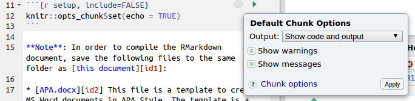

# Kandai.R #1 発表資料

ここは、Kandai.R #1 にて @kazutan が発表した「Rでドキュメントを生成しよう」の資料置き場です。

## Rでドキュメントを生成しよう

いわゆるR Markdown入門です。スライドへのリンクは[こちら](http://kazutan.github.io/KandaiR1/rmd_intro.html#/)です。

基本的なことをさらっと紹介しています。一番最後の参考資料にあげているのを一読してもらえればと思います。以下解説と補足です。

### Markdown記法について

[サンプルのmdファイル](http://kazutan.github.io/md_sample.md)を(ちゃんと)作りました。htmlへのレンダリング結果は[こちら](http://kazutan.github.io/md_sample.html)です。実際作業するならRStudioのメニューのHelpから"Markdown Quick Reference"を選択して、Helpビューに出てくるのを見るのが一番です。

### 対応する出力形式について

繰り返しますが、**Rmdの出力はhtmlが最強**です。それ以外はメリットが半減します。またhtmlと言ってもいろいろありますし、他のパッケージでいろんなものが使えます。そのあたりについてはぼちぼちどっかでまとめるかプレゼンします。

### Rチャンクについて

チャンクを挿入するには"Ctrl+Alt+I"が便利です。もしくは緑のCのボタンがありますので、これでもいいかと

あと、最近のRStudioなら、チャンク部分の一行目に歯車ボタンがあり、ここから基本的な設定が可能です:



よくわからなかったら、これで設定してしまってもOKです。使っていくと段々「こういうのできないのかなぁ」と思う場面が出てくるはずですので、その時に調べて学んでいければいいと思います。

### yamlヘッダ

「やむる」と読むそうです。Rmdを新規で作成した時にファイル先頭に出てくる、以下のような部分です:

````
---
title: "Untitled"
author: "kazutan"
date: "2016/6/20"
output: html_document
---
````

スライドで説明したとおりですが、YAML記法でいろんなことが設定できますし、Pandocに慣れている方はここで直接Pandocにオプションを渡せます。詳しくは本家のドキュメントを参照してください。

### Citationの使い方

この発表のメインその1です。

かつてはできなかったのですが、Pandocを採用してからはこの機能が実装されました。おそらく研究者にとってはこの機能は必須なものとなるはずですが、国内記事ではほとんど見かけません。なんででしょう…。

詳しくは[本家の解説ドキュメント](http://rmarkdown.rstudio.com/authoring_bibliographies_and_citations.html)をご覧ください。文献管理をMendeleyなどで管理している方は、この機能の凄さを体感できるかと思います。要するにExportして、それをRmdの冒頭YAMLに追加すればOKです。あとは自動的に並べてくれます。対応形式も豊富ですし、論文などを執筆するならベースはRmdでやればいいはずです。

なお、発表の時に使用していた`APA.csl`は[こちら](http://my.ilstu.edu/~wjschne/442/Introduction_to_RMarkdown.html)からDLしました。なお、パッケージとして{papaja}というのが提供されているのですが、私の手元で検証した結果、紹介を見送りました。国際誌なら全く問題ないですが、日本語を含む場合微妙でしたので…。

### テンプレートの活用

この発表のメインその2です。

企画者からの指令があったので頑張りました…が、正直完璧に仕上げるのは無理でした。なおデモで使用したdocxファイルは[こちら(Dropbox)](https://dl.dropboxusercontent.com/u/62654521/set_APAlike.docx)においてます。Githubだとバイナリファイルがなんか崩れるっぽいので…。

テンプレートの当て方などについては本家ドキュメントを参照してください。

## 質問など

この内容について質問などありましたら、このリポジトリのissueもしくはTwitterの@kazutanまでおねがいします。


